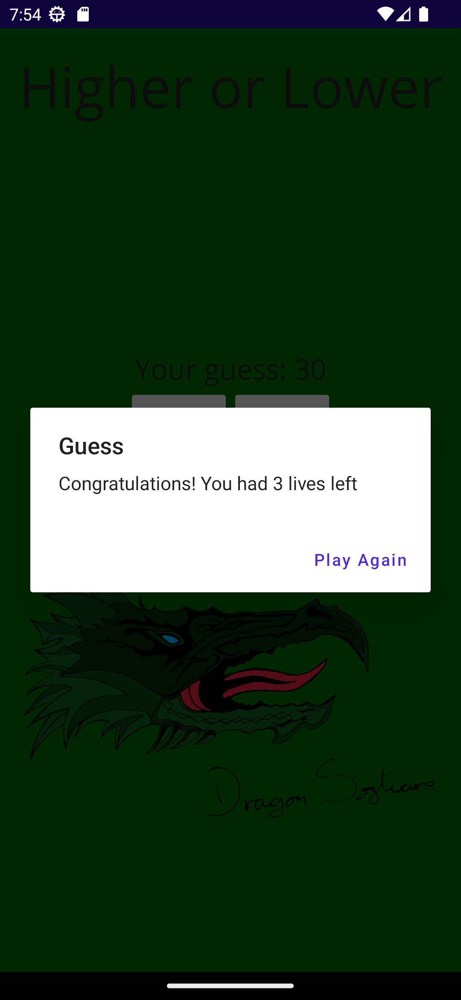

## Table of contents
* [General info](#general-info)
* [How to run / build](#how-to-run/build)
* [Technologies](#technologies)
* [Project Goals](#project-goals)
* [Screenshots](#screenshots)
* [Authors](#authors)

## General info
This project is a remake of my Higher or Lower mobile app, created using the new .NET Maui framework for android devices.

The original application is a simple guessing game, where the app asks the user to guess a number between 1 - 50, 
the user has 5 lives and once the lives are used or the correct number is given the game restarts with a new random number between 1 - 50

## How to run / build
As this appliccation has not been published, the reposetory will need to be cloned and the solution built onto a device using Visual Studio.

## Technologies
Project is created with:
* C#
* .Net Maui

## Project Goals
My goals for this project were to get a grasp of the basics of the .NET Maui framework, and to update my old application and get it published to the google play store again.

## Screenshots

## Authors
Oliver Swindlehurst
